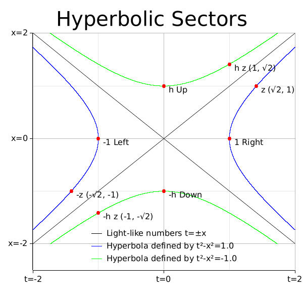
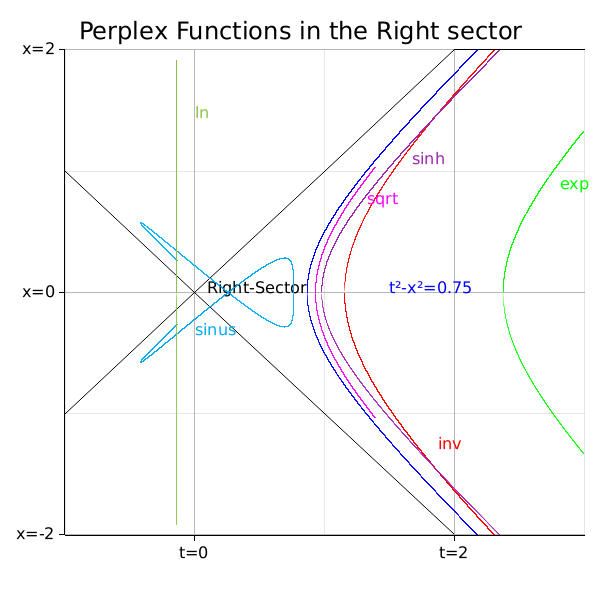
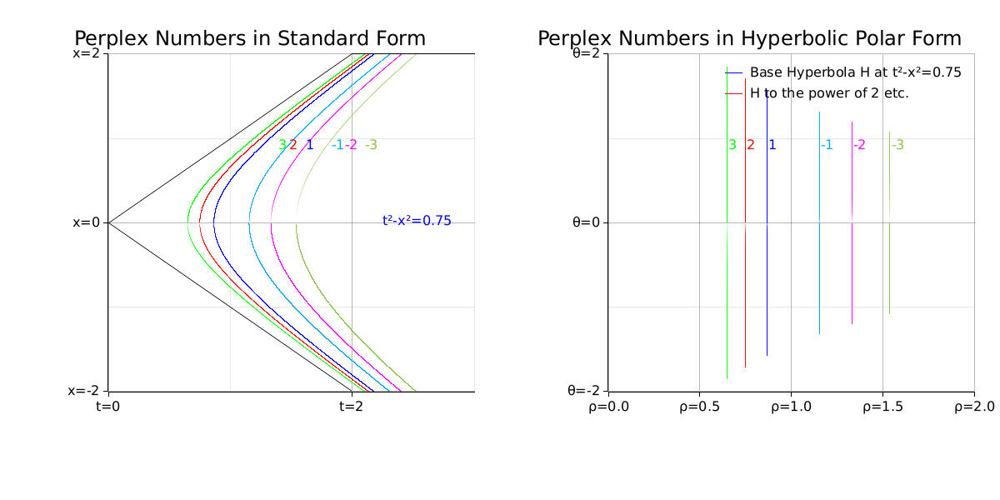

# Perplex Numbers
Perplex numbers, also known as **split-complex**, **double** or **hyperbolic** numbers, are an extension of the real numbers $\mathbb R$ by introducing a new element $h$ with the property that $h^2=1$, which is distinct from the imaginary unit $i$ in complex numbers ($i^2=-1$). $h$ is referred to as **hyperbolic unit**. A perplex number $z$ is expressed as:
$$z=t + x h \quad t,x \in \mathbb R \quad h^2=1 \quad h\not=\pm 1$$
The perplex numbers have applications in various fields for instance special relativity. In the context of Minkowski space, which is used in special relativity, the variables $t$ and $x$ typically represent **time** (the real part of $z$) and **space** (a spatial coordinate - the hyperbolic part of $z$). A thorough description of hyperbolic numbers in this regard can be found in [The Mathematics of Minkowski Space-Time](https://doi.org/10.1007/978-3-7643-8614-6). They form a two-dimensional commutative algebra over the real numbers, similar to the complex plane, but with a different geometric interpretation due to the hyperbolic unit.

## Crate Modules
- `perplex`: Defines the `Perplex` struct and associated methods such as hyperbolic trigonometric functions.
- `polar`: Contains the `HyperbolicPolar` and `HyperbolicSector` types for representation in hyperbolic polar coordinates.
- `binary_ops`: Implements binary operations like addition and multiplication.
- `single_ops`: Provides single operand operations like negation, inversion and exponentiation.
- `matrix`: (Optional feature) Implements matrix forms and operations for hyperbolic numbers.

## Basic Operations
The perplex numbers form an algebraic ring with addition and multiplication (see [Wikipedia](https://wikipedia.org/wiki/Split-complex_number) for a definition in terms of abstract algebra). Let $z_1=t_1+x_1h$ and $z_2=t_2+x_2h$ be two perplex numbers:

- **Addition** is component-wise: $$z_1+z_2 = (t_1+t_2) + (x_1+x_2)h$$
- **Multiplication** is given by: $$z_1 z_2 = (t_1t_2 + x_1x_2 ) + (t_2x_1 + t_1x_2)$$

Let $z=t+xh$ be a perplex number:
- **Conjugate** of a perplex number is: $$\bar z = t - xh$$
- **Squared Distance** is defined by the quadratic form $D$, and can be negative: $$D(z)=z\bar z = t^2-x^2$$
- **Modulus (magnitude)** is the square root of the absolute value of $D(z)\in \mathbb R $: $$\vert z \vert = \sqrt{\vert D(z) \vert}$$
- **Inverse** $z^{-1}=\frac{1}{z}$ is the perplex number that multiplies to the neutral element of multiplication ($zz^{-1}=1$). It is given by: $$z^{-1}=\frac{\bar z}{D(z)}=\frac{t - xh}{t^2-x^2}$$

Perplex numbers include elements called null vectors or **zero divisors**, which are of the form $x+xh$ or $x-xh$, with $x\not=0$. These are exactly the non-zero elements with a modulus of zero. These numbers are not invertible, meaning they do not have a multiplicative inverse within the set of perplex numbers.

## Hyperbolic Plane: Time-, Space- or Light-Like
The hyperbolic plane can be divided into four distinct sectors by the intersection of two diagonals, $( t = x )$ and $( t = -x )$. These diagonals are essentially the lines of light-like perplex numbers where the time and space components are equal in magnitude but may differ in sign. Here's a description of each sector:

- **Right Sector**: This sector is defined by the condition $( t > |x| )$. It lies to the right of both diagonals and represents the region where the time component is greater than the space component in absolute value.
- **Up Sector**: Located above the diagonal $( t = x )$ and to the left of the diagonal $( t = -x )$, the up sector is characterized by $( x > |t| )$, indicating that the space component is greater than the time component in absolute value.
- **Left Sector**: The left sector is the mirror image of the right sector, lying to the left of both diagonals. It is defined by $( -t > |x| )$, where the negative time component is greater in magnitude.
- **Down Sector**: This sector is the mirror image of the up sector, defined by $( -x > |t| )$.

These sectors are important in the study of hyperbolic geometry and perplex numbers, as they determine the nature of the functions and operations that can be performed within each region. Certain functions may only be well-defined or invertible in specific sectors of the hyperbolic plane. The square root of a perplex number, for instance, is only defined within the right sector.

The common categorization of perplex numbers is based on the squared distance. A number is:
- **time**-like if D(z) > 0, i.e., it lies in the **Right** $(t>|x|)$ or **Left** $(-t>|x|)$ sector 
- **space**-like if D(z) < 0, i.e., it lies in the **Up** $(x>|t|)$ or **Down** $(-x>|t|)$ sector
- **light**-like if D(z) = 0, i.e., it lies on one of the diagonals $(t=x)$ or $(t=-x)$

The inversion of a perplex number, for instance, is only defined for time- or space-like numbers, more info at [Fundamental Theorems of Algebra for the Perplexes](https://doi.org/10.4169/074683409X475643).

In the context of perplex numbers, the Klein group $(\{1, h, -1, -h\}, \cdot)$ corresponds to transformations that map perplex numbers to different sectors of the hyperbolic plane. Here's how each element relates to the sectors:

- The identity element **1** leaves a perplex number in the same sector.
- The element **h** acts as a mirror along the diagonals, effectively flipping the time and space components. For instance, it maps right to up.
- The element **-1** represents a vertical and horizontal mirror, changing the sign of both components. It maps up to down and right to left.
- The element **-h** combines the effects of **h** and **-1**.
An interesting feature of the Klein group is that each element is its own multiplicative inverse. More infos about the sectors and the Klein group can be found in Tab. 1 and Appendix B of [Hyperbolic trigonometry in two-dimensional space-time geometry](https://doi.org/10.1393/ncb/i2003-10012-9)

## Hyperbolic Functions

Building upon the foundational operations such as addition and multiplication, the `perplex_num` crate includes a variety of functions tailored for perplex numbers. Most of the functions are implemented to operate over the complete hyperbolic plane.

The accompanying image provides a graphical representation of a subset of these functions, tracing their behavior across a portion $(0.75 \le t < 3)$ of the hyperbola $H=\{z=(t,x)| t^2-x^2=0.75\}$(blue) in the right sector $(t>|x|)$. A curve of function $f$ corresponds to the image $f(H)$ of the hyperbola, visualizing the mapped perplex numbers $f(z)$.

Multiplication by elements of the **Klein** group allows for the mapping of a perplex number from its original sector to another. This property is utilized in the implementation of functions like the exponential (**exp**) and natural logarithm (**ln**) to ensure consistency across the entire plane. For instance, to compute the exponential of a perplex number, the number is first mapped to the Right Sector, `exp` is applied, and then the result is mapped back to the original sector using the same element (which is the inverse). This approach guarantees that `ln` is the inverse of `exp` and vice versa.

## Polar and Matrix Representation

The `perplex_num` crate provides the **HyperbolicPolar** struct for representing perplex numbers in a hyperbolic sector by means of an angle and a distance, as well as a symmetric matrix form with $4$ real entries.

### Hyperbolic Polar Form
The hyperbolic polar form is expressed as $(\rho, \theta, s)$, where $ \rho$ and $\theta$ are non-negative real numbers, and $s$ indicates the sector $s\in \{Right, Up, Left, Down\}$. Here, $ \rho$ is the modulus, calculated as the square root of the absolute value of the squared distance, and $\theta$ is the argument of a perplex number $z$, defined by the following piecewise function:

$$
\theta = \arg(z) =
\begin{cases} 
\infty & \text{if } t = x \text{ (light-like on the line } x = t\text{)} \\
-\infty & \text{if } t = -x \text{ (light-like on the line } x = -t\text{)} \\
\text{atanh}\left(\frac{x}{t}\right) & \text{if } |t| > |x| \text{ (time-like)} \\
\text{atanh}\left(\frac{t}{x}\right) & \text{if } |x| > |t| \text{ (space-like)}
\end{cases}
$$

The argument function is derived from Eq. 4.1.6 in Section 4.1.1 "Hyperbolic Exponential Function and Hyperbolic Polar Transformation" in *The Mathematics of Minkowski Space-Time*. Lines $( x=t )$ and $( x=-t )$ are mapped to $( \infty )$ and $( -\infty )$, respectively, as detailed in Section 4.1 of *New characterizations of the ring of the split-complex numbers and the field C of complex numbers and their comparative analyses*.
Exponentiation for the `HyperbolicPolar` struct is implemented based on an extended version of Formula 4.6 from the same literature, ensuring a consistent approach across the entire plane.

The accompanying images illustrate the mapping of the hyperbola $H=\{z=(t,x)| t^2-x^2=0.75\}$, depicted in blue, from the right sector $(t>|x|)$ of the standard form on the left to the hyperbolic polar coordinates on the right. Additionally, the images showcase the transformation of $H$ under the power function $z^n$ for $n\in\{-3,-2,-1,2,3\}$, with each power represented by a distinct color. The right plot selectively displays portions of $H$ and its powered counterparts that correspond to the visible region in the left plot.

### Matrix Form
In matrix form, a perplex number $z = t + xh$  is represented as a symmetric 2x2 matrix:

$$
\begin{pmatrix}
t & x \\
x & t
\end{pmatrix}
$$

This representation aligns with standard matrix operations, where addition and multiplication correspond to their matrix counterparts.

### Benchmarking
The `benches` directory contains a **Criterion** suite of benchmarks designed to evaluate the performance of various exponentiation methods for perplex numbers. These methods include:

- **Naive Loop**: This method involves straightforward repeated multiplication of the perplex number by itself.
- **Squaring**: A more sophisticated algorithm that minimizes the number of multiplications through exponentiation by squaring.
- **Matrix Form**: This approach leverages the matrix representation of perplex numbers for exponentiation.
- **Polar Form**: Focusing on the hyperbolic polar form, this method is central to the benchmarks and may offer efficiency gains for large exponents.

The benchmarking results have informed the implementation of the `Pow<u32>` trait for the `Perplex` struct, favoring the **exponentiation by squaring** algorithm for its efficiency.